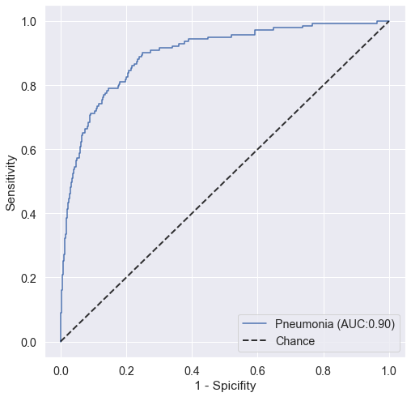
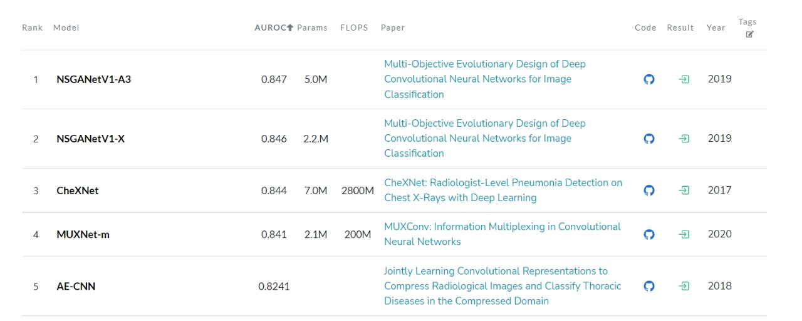

# Pneumonia detection using x-ray images
Pneumonia is a lung infection or swelling (inflammation) of the tissue in one or both lungs. Also, Pneumonia can be defined as a severe acute respiratory disease which is caused when the air sacks(alveoli) in lungs is infected. 

### What we did
We used "efficientnet_b1", pretrained model but with custom classifier
We used "Adam" optimizer and "BCEWithLogitsLoss" criterion

### Results
We used AUROC to compare our results with others 
##### Our AUROC = 0.90 
as shown in the graph below and it is higher than any reached score as you will see in the image below

And in this image you will find the best reached AUROC scores 

